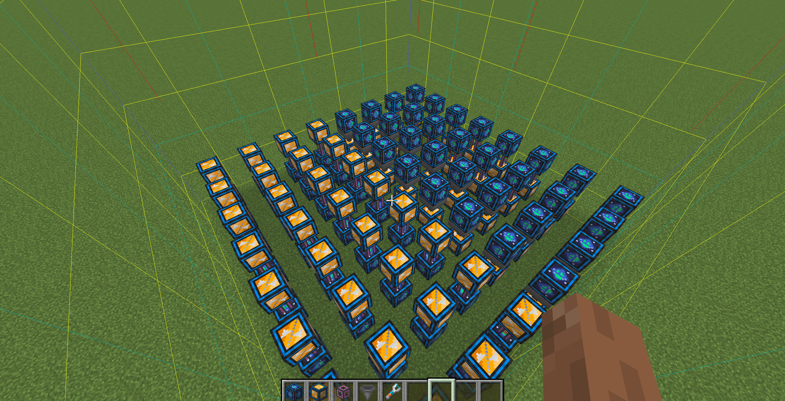
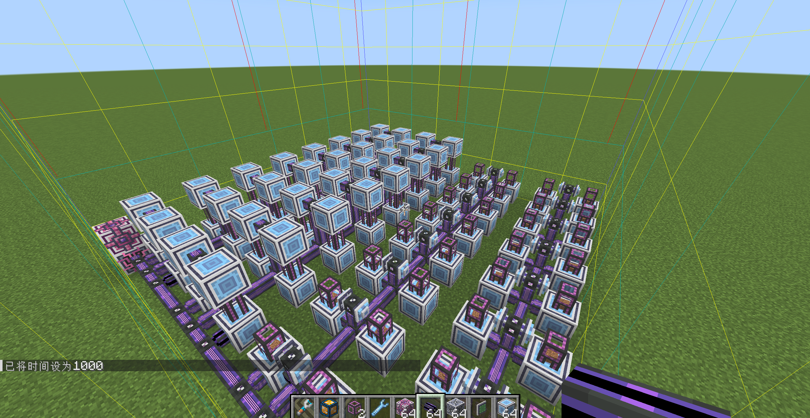

图为仅超越维度的测试场景：

左侧使用32个网络接口开启弹出模式，向mek管道输出泥土，mek管道则将泥土通过网络通道送回维度网络。

右侧上方为32个网络通道，分别由16个mek管道和16个原版漏斗主动抽取物品送到网络接口，再由网络接口送回维度网络。

共计使用64个网络通道、64个网络接口、48个mek管道、16个原版漏斗

测试开始后打开超越维度的UI界面，一并测试UI同步性能

---

图为AE+超越维度的测试场景，测试中关闭了频道限制：

me驱动器在me控制器右侧，图中被遮挡，其中仅放置一个维度me磁盘作为唯一存储。

左侧上方为32个me接口，每个接口均仅为第一格标记泥土64个，然后由mek管道主动抽取，送到下方的me接口，由me接口送回ae并进入维度网络。

右侧为上方为32个me输出总线，均填满加速卡，标记一格泥土。mek管道为被动模式，接收后送到下方me接口，再由me接口送回ae并进入维度网络。

共计使用96个me接口、32个输出总线、64个mek管道

测试开始后打开无线终端，一并测试UI同步性能

对于纯AE的测试场景，与其唯一区别只是将维度ME磁盘替换成了21个64k存储元件，并添加了2个me驱动器用于容纳。

